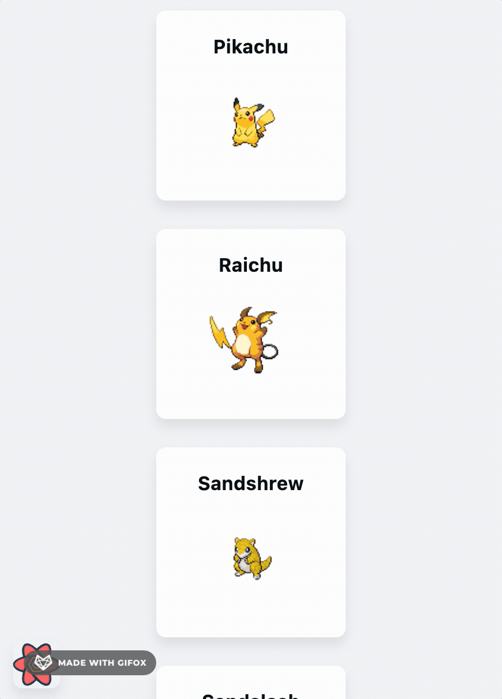

# ⚡️🐭️ 🔥🦎 🐢

The demo react application builds infinite list of pokémon's data called from [PokémonAPI](https://pokeapi.co/) using [react-query](https://react-query.tanstack.com/).

## Alright, let's begin.

```bash
yarn install
yarn start
```

## Scrolling! 👆


